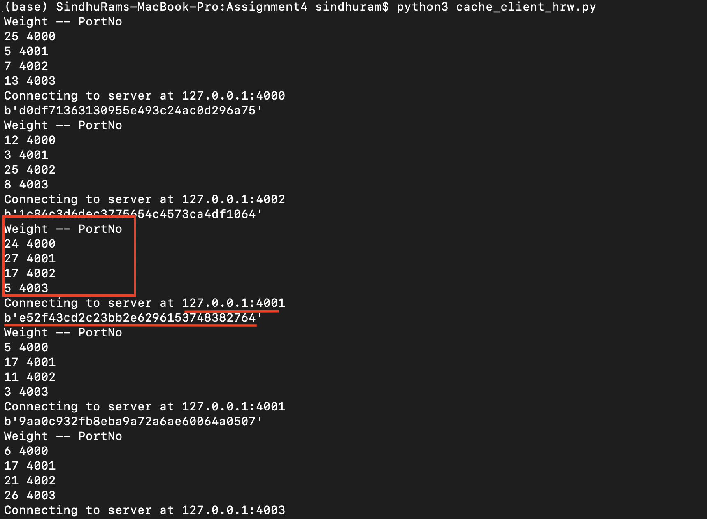
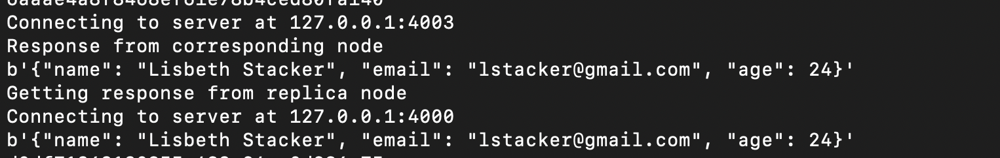

# Consistent Hashing and RHW Hashing

The distributed cache you implemented in the midterm is based on naive modula hashing to shard the data.

## Part I.

Implement Rendezvous hashing to shard the data.

### Rendezvous hashing implementation screenshots and explanation

File - cache_client_hrw.py

Based on weight of the node, request is routed to highest weighed node as shown below

Any further request with that hash value will be routed to same node as shown below

## Part II.

Implement consistent hashing to shard the data.

Features:

* Add virtual node layer in the consistent hashing.
* Implement virtual node with data replication. 

### Consistent Hashing implementation screenshots and explanation

File - cache_client_ch.py

PNode --> Physical Node - 4

VNode --> Virtual Node - 8

Ring size - 100

Ring Topology - Node 0 (Port - 4000) -> Node 1 (Port - 4001) -> Node 2 (Port - 4002) -> Node 3 (Port - 4003) -> Node 0 (Port - 4000)

Replication Factor is 2

#### Node allocation 

Hash value of the key is 77 which falls after physical Node 3. So this key should be routed to next physical node whcih is Node 0 (Port-4000) (For this example took vnode as 8 and replica as 1)

#### Replication factor validation

Retreived data from corresponding node and the replica node. Data is same in both the nodes for the corresponding GET

